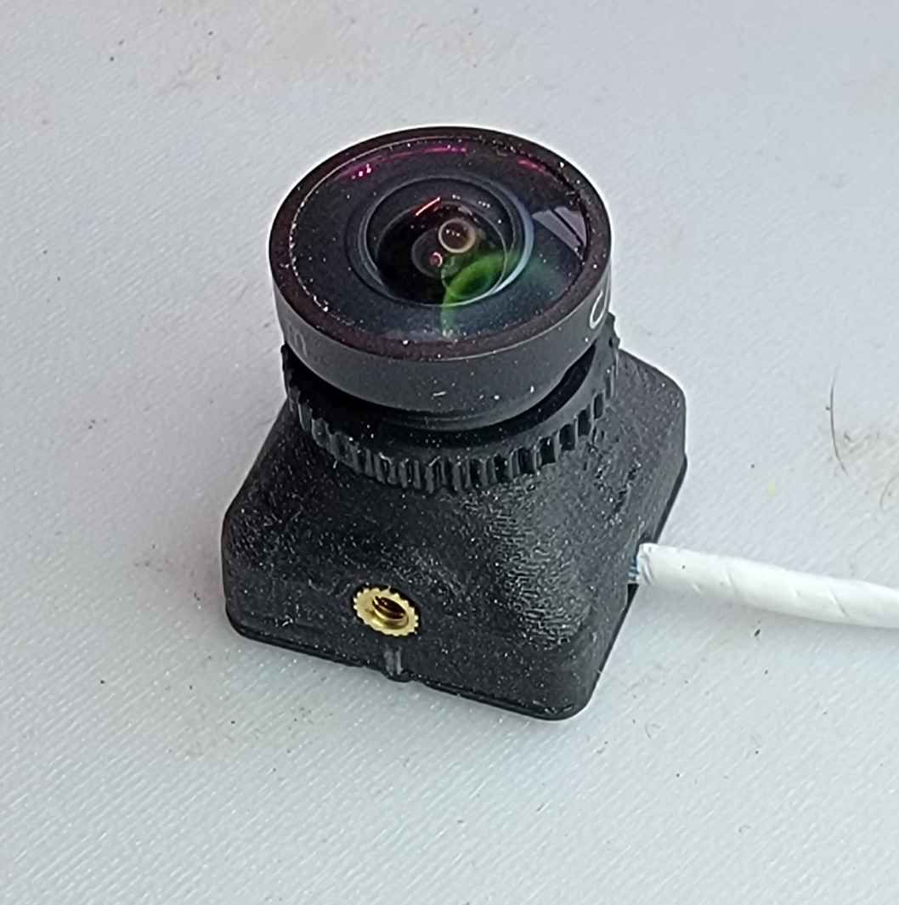

# HDZero Nano Cam 19mm (Micro) Body for M12 Lenses 

Body and cover which supports the HD Zero Nano Cam (not to be confused with the original RunCam HD Nano) sensor board, which uses the same sensor as the Micro cam that is hard to acquire presently, and allow the use of an M12 lens.

- Print in ABS using a 0.25mm nozzle at 0.04mm layer height for best thread resolution. 
- 3 perimeters minimum
- Infill can be any pattern and percentage - I have been using 40% gyroid infill.
- Should be possible to print with 0.40mm nozzle, threads may require chasing with an M12x0.5 tap, or using the edge of an M3x0.5 tap or filed down screw.

## BOM

- (2) M2x3 Heat Set Inserts [Amazon](https://www.amazon.com/gp/product/B01IZ157KS)
- (2) M1.2x3 Screws
- (4) M1.2 Screws from HDZ Nano Cam Body
- (1) M12 Lens [Like This](https://pyrodrone.com/products/caddx-1-66mm-replacement-lens-for-ratel)

